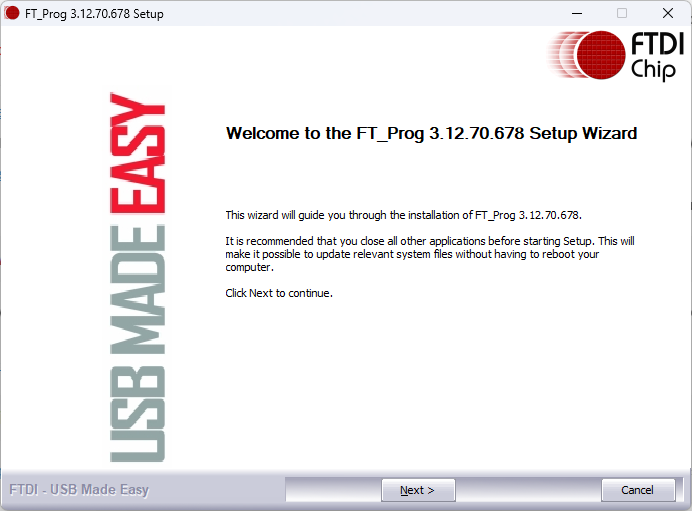
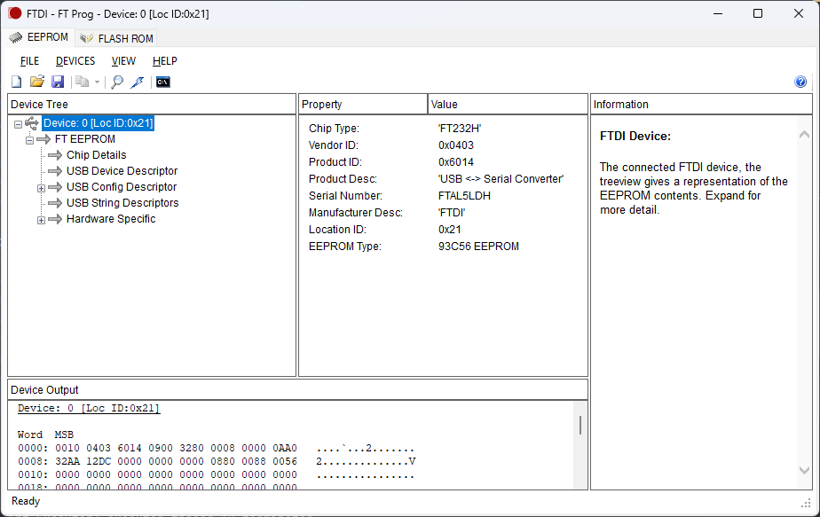
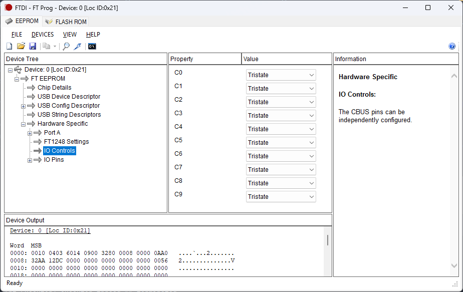
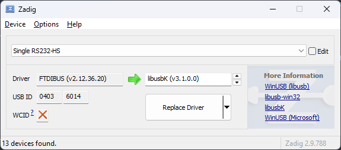
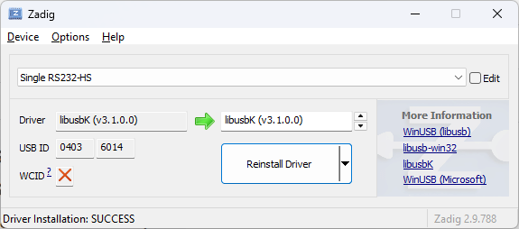

# HCE Laboratory - Host card emulator for PN7160

A high-performance, low-latency implementation of the **ISO/IEC 14443-4 (ISO-DEP)** HCE designed for the **PN7160** NFC Controller. This framework enables advanced Card Emulation (CE) and protocol analysis on **PC** platforms.

> [!NOTE]
> This project is still in an early stage. I’m publishing it so it can be useful to those who are researching the PN7160 chip or HCE emulation.

> [!TIP]
> Currently, the emulation is operational and all APDUs are receiving a response from a fake T4T target with 0x6E00 to demonstrate successful configuration of the PN7160 and command processor.

> [!IMPORTANT]
> I'm open to ideas, but please don't open issues. I know there's still a lot to do...
> If you like this project, please leave me a star or email me, so I know it generates interest in continuing to work on it.

## Overview

This project provides a robust abstraction layer for the PN7160, utilizing the **NCI (NFC Controller Interface) 2.0** standard. Unlike standard high-level APIs, this stack grants full control over the protocol transmission and APDU exchange, making it an ideal tool for researchers and developers working on proximity systems.

The core engine is designed to handle complex state machines required for modern secure element emulation, ensuring high compatibility with professional proximity readers.

## Key Features

* **ISO-DEP Compliance**: Implementation of emulation for T4T with ISO/IEC 14443-4.
* **Hardware-Level Optimization**: Optimized for the PN7160 NCI 2.0 interface to achieve minimal frame-turnaround time.
* **Advanced Card Emulation (CE)**: Support for emulating standardized Type 4 Tags (T4T) with custom UID, SAK, and ATQA configurations.
* **APDU Transparency**: Full logging and interception of Application Protocol Data Units (APDU) for diagnostic and auditing purposes.
* **Cryptographic Pass-through**: Engineered to support high-level secure handshakes (such as AES or 3DES) by providing a transparent data link layer.
* **Cross-Platform Architecture**: Modular C/C++ core ready for integration via USB-to-I2C/SPI bridges or serial interfaces.

## Early stage screenshot

This screenshot shows ISO-DEP communication between a desktop reader running Windows and the responses generated by this software.


## Technical Specifications

| Layer | Standard / Protocol                                    |
| :--- |:--------------------------------------------------------|
| **Physical / MAC** | ISO/IEC 14443-A, ISO/IEC 14443-B          |
| **Data Link Layer** | ISO/IEC 14443-4 (ISO-DEP)                |
| **Controller Interface** | NCI 2.0 (I2C / SPI)                 |
| **Emulation Mode** | Proximity Integrated Circuit Card (PICC)  |
| **Data Rates** | Support for 106, 212, 424, and 848 kbit/s     |

## Project Goals

1.  **Protocol Research**: Provide a reliable tool for studying the behavior of proximity readers and their implementation of international standards.
2.  **System Auditing**: Enable security professionals to perform stress tests and latency analysis on access control infrastructures.
3.  **Hardware Enablement**: Offer a modern, open-source alternative for the PN7160 controller, moving away from legacy chips like the PN532.

## Supported Hardware

This stack is designed to work with a high-performance hardware bridge to ensure minimal latency during ISO-DEP transactions, currently between 2.5ms a 4ms.

### 1. NFC Controller: NXP PN7160
The **PN7160** is the core of the emulation engine. Unlike legacy controllers, it supports the latest NCI standards and offers superior stability for Card Emulation (CE) modes.

### 2. USB Bridge: FTDI FT232H
To interface the PN7160 with a PC, the project utilizes the **FT232H** in **SPI mode** (via MPSSE - Multi-Protocol Synchronous Serial Engine). This configuration is preferred over I2C due to:
* **Higher Throughput**: Essential for high-bitrate ISO-DEP frames.
* **Lower Latency**: Critical for meeting the strict Frame Waiting Time (FWT) requirements of the ISO 14443-4 standard.

For PN7160 I use the development board [OM27160B1](https://www.nxp.com/design/design-center/development-boards-and-designs/PN7160-EVK) with USB-SPI bridge [Adafruit FT232H Breakout](https://www.adafruit.com/product/2264) (or similar product).

**OM27160B1HN Board (OM27160A1HN is I2C version)**


| J1 | PN7160 Signal                                             |
|:---|:----------------------------------------------------------|
| #1 | VDD(PAD): 1.8 V or 3.3 V host interface voltage reference |
| #2 | VDD(PAD): VDD(UP/VBAT: 2.8 V to 5.5 V supply voltage      |

| J2 | PN7160 Signal (only relevant for OM27160A1HN I2C version) |
|:---|:----------------------------------------------------------|
| #1 | I2C_SDA: I2C-bus serial data                              |
| #2 | I2C_SCL: I2C-bus serial clock input                       |

| J3 | PN7160 Signal                       |
|:---|:------------------------------------|
| #1 | Not connected                       |
| #2 | GND: ground                         |
| #3 | IRQ: interrupt request output       |
| #4 | VEN: reset pin input                |
| #5 | DWL_REQ: download request pin input |
| #6 | Not connected |

| J4 | PN7160 Signal                                                 |
|:----|:--------------------------------------------------------------|
| #1  | SPI_COTI: SPI-bus Controller Output, Target Input data (MOSI) |
| #2  | SPI_CITO: SPI-bus Controller Input, Target Output data (MISO) |
| #3  | SPI_NSS: SPI-bus Target Select (SCK)                          |
| #4  | SPI_SCK: SPI-bus Serial Clock (CS)                            |
| #5  | Not connected                      |
| #6  | Not connected                                                 |

**FT323H Breakout (USB-C to SPI bridge)**


## Hardware Connection Schema (SPI mode)

To interface the OM2760B1HN with the Adafruit FT232H, follow this pin mapping. This configuration ensures proper power management and interrupt handling for real-time ISO-DEP emulation.

| FT232H Pin | OM2760B1HN Pin  | 	Function           | 	Description                   |
|:-----------|:----------------|:--------------------|:----------------------------------|
| D0         | J4/#4 - SCK     | Serial Clock        | SPI Clock Signal                  |
| D1         | J4/#1 - MOSI    | Master Out Slave IN | Data from PC to PN7160            |
| D2         | J4/#2 - MISO    | Master In Slave Out | Data from PN7160 to PC            |
| D3         | J4/#3 - NSS     | Chip Select	        | SPI Slave Select (Active Low)   |
| D5         | J3/#3 - IRQ     | Interrupt Request   | PN7160 signaling data ready       |
| C2         | J3/#5 - DWL_REQ | Download Request    | Firmware update / Bootloader mode |
| C3         | J3/#4 - VEN	    | PN7160 Enable       | Reset/Power control for PN7160    |
| GND        | J3/#2 - GND     | Common Ground	      | Shared reference                  |
| 3V         | J1/#1 - 3V      | Logic Level VCC     | Reference for I/O logic levels    |
| 5V         | J1/#2 - 5V	    | System Power	       | Main power supply for the board  |


### FT323H & OM27160B1HN connection


**Homemade board stack**


*Note: C1 PIN is connected only for mechanical stability, not used for anymore.*

## Targets supported

I am currently developing an advanced emulator that would be compatible with the Desfire protocol based on existing public documentation. However, it could be extended to any type of card or device that uses ISO-DEP as its transport layer, ISO14443-4.

This emulation allows you to freely set the values ​​of AQTA, SAK, and UID, making it an ideal tool for analyzing reader behavior without needing real cards.

### Links to public datasheets and online specs

The following links are the original online resource links are archived here for documentation on how this emulation works:

* [ISO/IEC 7816-4 Standard](https://www.freecalypso.org/pub/GSM/ISO7816/ISO_7816-4_2005.pdf)
* [DESFire EV0 Datasheet (M075031, April 2004)](https://web.archive.org/web/20170201031920/http://neteril.org/files/M075031_desfire.pdf)
* [DESFire Functional specification (MF3ICD81, November 2008)](https://web.archive.org/web/20201115030854/https://marvin.blogreen.org/~romain/nfc/MF3ICD81%20-%20MIFARE%20DESFire%20-%20Functional%20specification%20-%20Rev.%203.5%20-%2028%20November%202008.pdf)
* [NXP Application Note AN12343](https://www.nxp.com/docs/en/application-note/AN12343.pdf)
* [TI DESFire EV1 Tag AES Auth Specs (sloa213.pdf)](https://www.ti.com/lit/an/sloa213/sloa213.pdf)
* [NXP Application Note AN10833](https://www.nxp.com/docs/en/application-note/AN10833.pdf)

# Usage and build instructions

## FT223h Setup

For the USB-SPI adapter to work properly, it is necessary to configure the digital signals using the [**FT_Prog**](https://ftdichip.com/utilities/) utility. FT_PROG only works with the native driver, so do not change it until you complete this procedure.



After installations is finished the utility and select **DEVICES->Scan and Parse** to detect FT232h chip and load current EEPROM values.



In **Hardware Specific->IO Controls** ensure that all ports are configured to **Trisate** as shown below:



Now it is necessary to replace the native driver with one that allows the use of the FT232H through the libusb library using the [**zadig**](https://zadig.akeo.ie/) utility.

Select **Options->List All Devices** and find your adapter in device list, my board is detected as **Single RS232-HS** as show below.



Now, select target driver and press **Replace Driver**, (I recommend using **libusbK**), wait util the new driver is installed.



If for some reason your device does not work with this driver, you can check it with **WinUSB**; both should work fine.

## Build instructions

This project is based on Qt6 and MinGW-W64, with minimal dependencies.

Contains the following components:

- /src/hce-app/app-qt: Application interface based on Qt Widgets
- /src/hce-app/app-t4t: Command line test binary, without Qt and threading.
- /src/hce-lib/lib-ext: External libraries and drivers for FTDI chip.
- /src/hce-lib/lib-hw: Hardware abstraction layer for PN7160, USB, MPSSE etc.
- /src/hce-lib/lib-hce: Host card emulation core, and targets implementation.
- /src/hce-lib/lib-rt: Runtime utilities and thread management.

All can be compiled with mingw-g64, a minimum version is required to support C++17, recommended 11.0 or higher.

### Prerequisites

- CMake version 3.16 or higher
    - `winget install -e --id=Kitware.CMake`
    - alternative see http://www.cmake.org/cmake/resources/software.html
- Git-bash or your preferred git client
    - `winget install -e --id Git.Git`
    - alternative see https://gitforwindows.org/
- Qt6 framework 6.x
    - inside MSYS2: `pacman -S mingw-w64-x86_64-qt6-base`
    - alternative see https://www.qt.io/offline-installers
- GCC / G++ for Linux build, version 11.0 or later
    - inside MSYS2: `pacman -S mingw-w64-ucrt-x86_64-gcc`
    - alternative mingw-w64 11 for windows build see https://www.mingw-w64.org/downloads
- USB lib
    - inside MSYS2: `pacman -S mingw-w64-x86_64-libusb`
    - alternative using bundle dll contained in dll/usb/bin

### Manual build for Windows

Once you have all pre-requisites ready, clone the repository:
```
git clone https://github.com/josevcm/hce-laboratory.git
```

Create a **build** directory and configure the project (change `CMAKE_BUILD_TYPE=Debug` and `-B cmake-build-debug` for debug output)

```
cmake -DCMAKE_BUILD_TYPE=Release -G "CodeBlocks - MinGW Makefiles" -S hce-laboratory -B build

-- The C compiler identification is GNU 13.3.0
-- The CXX compiler identification is GNU 13.3.0
-- Detecting C compiler ABI info
-- Detecting C compiler ABI info - done
-- Check for working C compiler: /usr/bin/cc - skipped
-- Detecting C compile features
-- Detecting C compile features - done
-- Detecting CXX compiler ABI info
-- Detecting CXX compiler ABI info - done
-- Check for working CXX compiler: /usr/bin/c++ - skipped
-- Detecting CXX compile features
-- Detecting CXX compile features - done
-- Build for x86_64 in Release mode
-- Enabled SSE/SSE3 instruction set
-- libusb-1.0: found and using dynamic link mode
--   include: /usr/include/libusb-1.0
--   library: /usr/lib/x86_64-linux-gnu/libusb-1.0.so
-- libftdi1: found and using dynamic link mode
--   include: /usr/include/libftdi1
--   library: /usr/lib/x86_64-linux-gnu/libftdi1.so
-- Performing Test CMAKE_HAVE_LIBC_PTHREAD
-- Performing Test CMAKE_HAVE_LIBC_PTHREAD - Success
-- Found Threads: TRUE
-- Performing Test HAVE_STDATOMIC
-- Performing Test HAVE_STDATOMIC - Success
-- Found WrapAtomic: TRUE
-- Found OpenGL: /usr/lib/x86_64-linux-gnu/libOpenGL.so
-- Found WrapOpenGL: TRUE
-- Could NOT find XKB (missing: XKB_LIBRARY XKB_INCLUDE_DIR) (Required is at least version "0.5.0")
-- Found WrapVulkanHeaders: /usr/include
-- Configuring done (2.5s)
-- Generating done (0.0s)
-- Build files have been written to: /home/user/github/build
```

Compile the project:
```
cmake --build build --target hce-lab -- -j 6

[  1%] Building C object src/nfc-lib/lib-ext/microtar/CMakeFiles/microtar.dir/src/main/c/microtar.c.obj
....
[ 98%] Linking CXX executable hce-lab.exe
[100%] Built target hce-lab
```

Create a coppy of the application for easier access:

```
cp .\build\src\hce-app\app-qt\hce-lab.exe hce-lab.exe
```

Application is ready to use!

### Manual build for Linux

Install dependencies (ubuntu)

```
sudo apt install cmake g++ g++-11 qt6-base-dev libqt6svg6 libusb-1.0-0-dev zlib1g-dev libgl1-mesa-dev libftdi1-dev
```

Clone the repository
```
git clone https://github.com/josevcm/hce-laboratory.git
```

Create a **build** directory and configure the project (change `CMAKE_BUILD_TYPE=Debug` and `-B cmake-build-debug` for debug output)

```
cmake -DCMAKE_BUILD_TYPE=Release -S hce-laboratory -B build
```

Compile the project:

```
cmake --build build --target hce-lab -- -j$(nproc)
```

Create a symbolic link to the application for easier access:

```
ln -s build/src/hce-app/app-qt/hce-lab hce-lab
```

Launch the application:

```
./hce-lab
```

## License

This project is licensed under the **GNU General Public License v3.0 (GPL-3.0)**. This ensures that the core protocol stack remains open-source and benefits the global security community.

---

*Disclaimer: This project is intended for educational and professional auditing purposes only. Always ensure you have permission before testing on systems you do not own.*