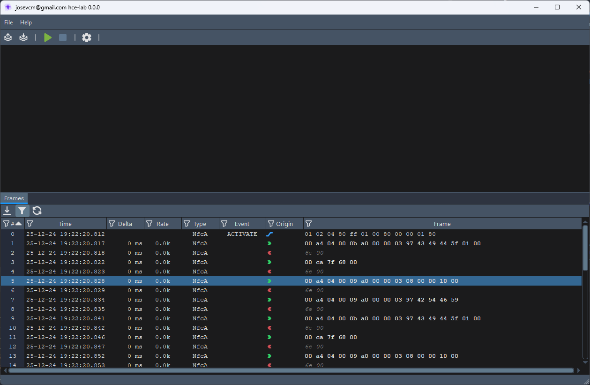
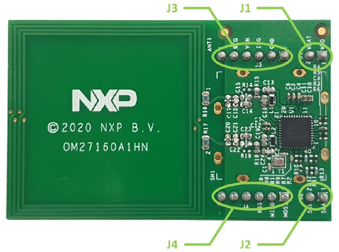
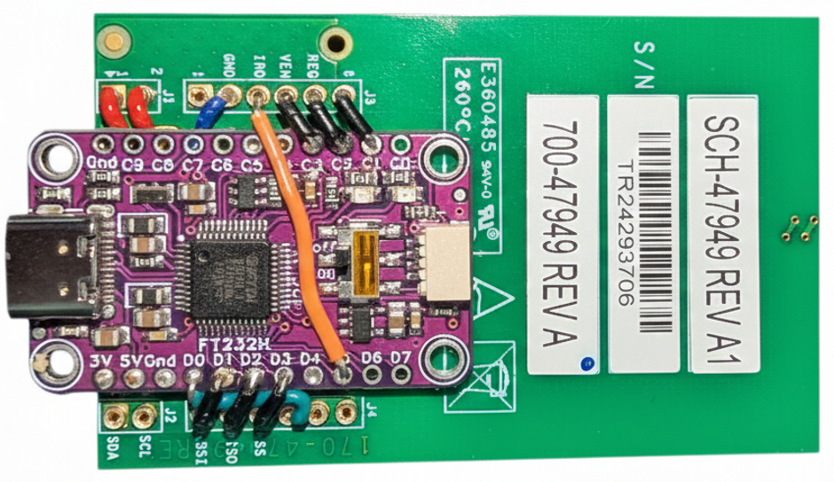

# HCE Laboratory - Host card emulator for PN7160

A high-performance, low-latency implementation of the **ISO/IEC 14443-4 (ISO-DEP)** HCE designed for the **PN7160** NFC Controller. This framework enables advanced Card Emulation (CE) and protocol analysis on **PC** platforms.

> [!NOTE]
> This project is still in an early stage. I’m publishing it so it can be useful to those who are researching the PN7160 chip or HCE emulation.

> [!TIP]
> Currently, the emulation is operational and all APDUs are receiving a response from a fake T4T target with 0x6E00 to demonstrate successful configuration of the PN7160 and command processor.

> [!IMPORTANT]
> I'm open to ideas, but please don't open issues. I know there's still a lot to do...

## Overview

This project provides a robust abstraction layer for the PN7160, utilizing the **NCI (NFC Controller Interface) 2.0** standard. Unlike standard high-level APIs, this stack grants full control over the protocol transmission and APDU exchange, making it an ideal tool for researchers and developers working on proximity systems.

The core engine is designed to handle complex state machines required for modern secure element emulation, ensuring high compatibility with professional proximity readers.

## Key Features

* **ISO-DEP Compliance**: Implementation of emulation for T4T with ISO/IEC 14443-4.
* **Hardware-Level Optimization**: Optimized for the PN7160 NCI 2.0 interface to achieve minimal frame-turnaround time.
* **Advanced Card Emulation (CE)**: Support for emulating standardized Type 4 Tags (T4T) with custom UID, SAK, and ATQA configurations.
* **APDU Transparency**: Full logging and interception of Application Protocol Data Units (APDU) for diagnostic and auditing purposes.
* **Cryptographic Pass-through**: Engineered to support high-level secure handshakes (such as AES or 3DES) by providing a transparent data link layer.
* **Cross-Platform Architecture**: Modular C/C++ core ready for integration via USB-to-I2C/SPI bridges or serial interfaces.

## Early stage screenshot

This screenshot shows ISO-DEP communication between a desktop reader running Windows and the responses generated by this software.

## Technical Specifications

| Layer | Standard / Protocol                                    |
| :--- |:--------------------------------------------------------|
| **Physical / MAC** | ISO/IEC 14443-A, ISO/IEC 14443-B          |
| **Data Link Layer** | ISO/IEC 14443-4 (ISO-DEP)                |
| **Controller Interface** | NCI 2.0 (I2C / SPI)                 |
| **Emulation Mode** | Proximity Integrated Circuit Card (PICC)  |
| **Data Rates** | Support for 106, 212, 424, and 848 kbit/s     |

## Project Goals

1.  **Protocol Research**: Provide a reliable tool for studying the behavior of proximity readers and their implementation of international standards.
2.  **System Auditing**: Enable security professionals to perform stress tests and latency analysis on access control infrastructures.
3.  **Hardware Enablement**: Offer a modern, open-source alternative for the PN7160 controller, moving away from legacy chips like the PN532.

## Supported Hardware

This stack is designed to work with a high-performance hardware bridge to ensure minimal latency during ISO-DEP transactions, currently between 2.5ms a 4ms.

### 1. NFC Controller: NXP PN7160
The **PN7160** is the core of the emulation engine. Unlike legacy controllers, it supports the latest NCI standards and offers superior stability for Card Emulation (CE) modes.

### 2. USB Bridge: FTDI FT232H
To interface the PN7160 with a PC, the project utilizes the **FT232H** in **SPI mode** (via MPSSE - Multi-Protocol Synchronous Serial Engine). This configuration is preferred over I2C due to:
* **Higher Throughput**: Essential for high-bitrate ISO-DEP frames.
* **Lower Latency**: Critical for meeting the strict Frame Waiting Time (FWT) requirements of the ISO 14443-4 standard.

For PN7160 I use the development board [OM27160B1](https://www.nxp.com/design/design-center/development-boards-and-designs/PN7160-EVK) with USB-SPI bridge [Adafruit FT232H Breakout](https://www.adafruit.com/product/2264) (or similar product).

**OM27160B1HN Board (OM27160A1HN is I2C version)**

| J1 | PN7160 Signal                                             |
|:---|:----------------------------------------------------------|
| #1 | VDD(PAD): 1.8 V or 3.3 V host interface voltage reference |
| #2 | VDD(PAD): VDD(UP/VBAT: 2.8 V to 5.5 V supply voltage      |

| J2 | PN7160 Signal (only relevant for OM27160A1HN I2C version) |
|:---|:----------------------------------------------------------|
| #1 | I2C_SDA: I2C-bus serial data                              |
| #2 | I2C_SCL: I2C-bus serial clock input                       |

| J3 | PN7160 Signal                       |
|:---|:------------------------------------|
| #1 | Not connected                       |
| #2 | GND: ground                         |
| #3 | IRQ: interrupt request output       |
| #4 | VEN: reset pin input                |
| #5 | DWL_REQ: download request pin input |
| #6 | Not connected |

| J4 | PN7160 Signal                                                 |
|:----|:--------------------------------------------------------------|
| #1  | SPI_COTI: SPI-bus Controller Output, Target Input data (MOSI) |
| #2  | SPI_CITO: SPI-bus Controller Input, Target Output data (MISO) |
| #3  | SPI_NSS: SPI-bus Target Select (SCK)                          |
| #4  | SPI_SCK: SPI-bus Serial Clock (CS)                            |
| #5  | Not connected                      |
| #6  | Not connected                                                 |

**FT323H Breakout (USB-C to SPI bridge)**

## Hardware Connection Schema (SPI mode)

To interface the OM2760B1HN with the Adafruit FT232H, follow this pin mapping. This configuration ensures proper power management and interrupt handling for real-time ISO-DEP emulation.

| FT232H Pin | OM2760B1HN Pin  | 	Function           | 	Description                   |
|:-----------|:----------------|:--------------------|:----------------------------------|
| D0         | J4/#4 - SCK     | Serial Clock        | SPI Clock Signal                  |
| D1         | J4/#1 - MOSI    | Master Out Slave IN | Data from PC to PN7160            |
| D2         | J4/#2 - MISO    | Master In Slave Out | Data from PN7160 to PC            |
| D3         | J4/#3 - NSS     | Chip Select	        | SPI Slave Select (Active Low)   |
| D5         | J3/#3 - IRQ     | Interrupt Request   | PN7160 signaling data ready       |
| C2         | J3/#5 - DWL_REQ | Download Request    | Firmware update / Bootloader mode |
| C3         | J3/#4 - VEN	    | PN7160 Enable       | Reset/Power control for PN7160    |
| GND        | J3/#2 - GND     | Common Ground	      | Shared reference                  |
| 3V         | J1/#1 - 3V      | Logic Level VCC     | Reference for I/O logic levels    |
| 5V         | J1/#2 - 5V	    | System Power	       | Main power supply for the board  |

### FT323H & OM27160B1HN connection

**Homemade board stack**

*Note: C1 PIN is connected only for mechanical stability, not used for anymore.*

## Targets supported

Currently working in T4T generic tags and Desfire compatible Emulation... 

## License

This project is licensed under the **GNU General Public License v3.0 (GPL-3.0)**. This ensures that the core protocol stack remains open-source and benefits the global security community.

---

*Disclaimer: This project is intended for educational and professional auditing purposes only. Always ensure you have permission before testing on systems you do not own.*