# HCE Laboratory - Host card emulator for PN7160

A high-performance, low-latency implementation of the **ISO/IEC 14443-4 (ISO-DEP)** HCE designed for the **PN7160** NFC Controller. This framework enables advanced Card Emulation (CE) and protocol analysis on **PC** platforms.

> [!NOTE]
> This project is actively developed. The core DESFire EV1 emulator and MifarePlus SL3 emulator are fully operational, with a comprehensive integration test suite.

> [!IMPORTANT]
> I'm open to ideas, but please don't open issues. I know there's still a lot to do...
> If you like this project, please leave me a star or email me, so I know it generates interest in continuing to work on it.

## Overview

This project provides a robust abstraction layer for the PN7160, utilizing the **NCI (NFC Controller Interface) 2.0** standard. Unlike standard high-level APIs, this stack grants full control over the protocol transmission and APDU exchange, making it an ideal tool for researchers and developers working on proximity systems.

The core engine handles complex state machines required for modern secure element emulation, ensuring high compatibility with professional proximity readers.

## Key Features

* **ISO-DEP Compliance**: Full implementation of T4T emulation over ISO/IEC 14443-4.
* **DESFire EV1 Emulation**: Complete server-side implementation of the DESFire protocol with 43 commands, supporting native (proprietary) and ISO 7816-4 wrapped APDUs.
* **MifarePlus SL3 Emulation**: Security Level 3 emulation with AES-128 mutual authentication, per-sector key management, value block arithmetic (increment, decrement, restore, transfer), and encrypted read/write operations. 17 commands implemented.
* **Hardware-Level Optimization**: Optimized for the PN7160 NCI 2.0 interface to achieve minimal frame-turnaround time (2.5–4 ms).
* **Cryptographic Support**: AES-128, 2K3DES, and 3K3DES session key derivation with CMAC integrity protection.
* **Transaction Support**: Full commit/abort transaction model with rollback for DESFire data files and records.
* **JSON-Based Card Images**: Card configurations loaded from JSON files — UID, keys, files, applications, and access rights fully configurable.
* **Dual Protocol Mode**: Automatic detection of native DESFire and ISO 7816-4 wrapped command frames.
* **APDU Transparency**: Full logging and interception of APDUs for diagnostic and auditing purposes.
* **Integration Test Suite**: 165 automated tests — 49 DESFire tests across 5 categories (security, PICC, application, ISO, transaction) and 116 MifarePlus SL3 tests — all running against an in-process loopback emulator or a physical PCSC reader.
* **Cross-Platform Architecture**: Modular C++17 core building on Linux and Windows (MSYS2).

## Screenshots

This screenshot shows the Qt6 GUI application with ISO-DEP communication between a desktop reader and the DESFire emulator.

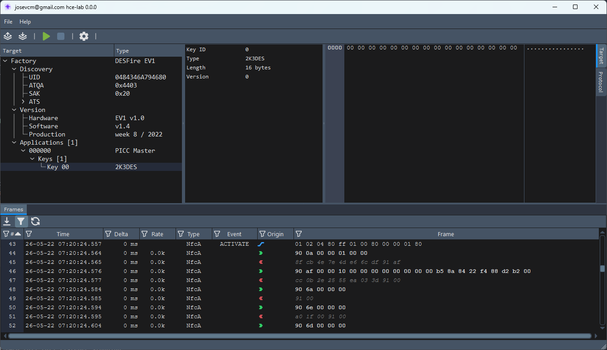

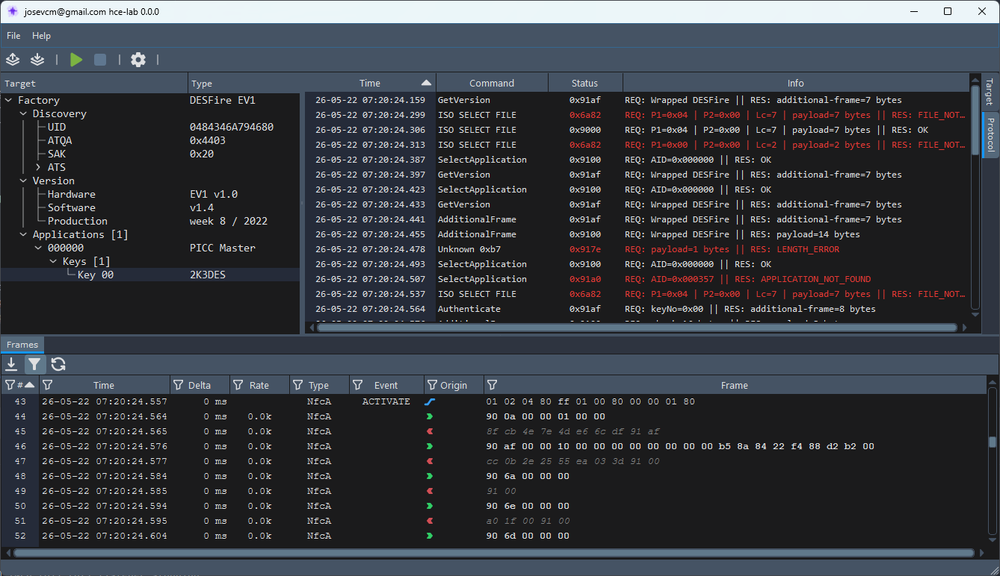

Timing measurement taken with [nfc-laboratory](https://github.com/josevcm/nfc-laboratory) using an Android mobile as reader and the PN7160 as card emulator — response latency 2.5–3.5 ms:

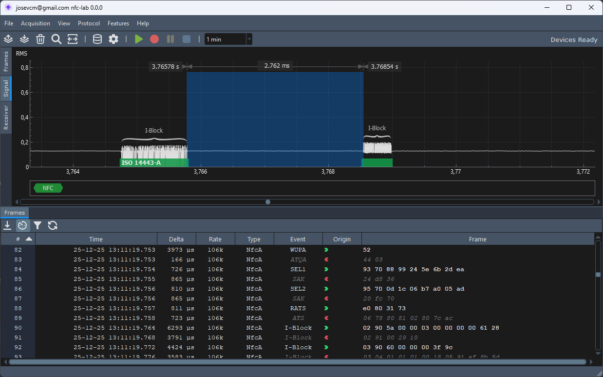

## Technical Specifications

| Layer | Standard / Protocol |
| :--- |:---|
| **Physical / MAC** | ISO/IEC 14443-A, ISO/IEC 14443-B |
| **Data Link Layer** | ISO/IEC 14443-4 (ISO-DEP) |
| **Controller Interface** | NCI 2.0 (I2C / SPI) |
| **Emulation Mode** | Proximity Integrated Circuit Card (PICC) |
| **Data Rates** | 106, 212, 424, and 848 kbit/s |

---

## Supported Targets

### T4T (Type 4 Tag)

A minimal ISO 14443-4 compliant stub target. Responds to all APDUs and serves as a base for custom emulation.

### DESFire EV1

A full-featured server-side emulator. Card images are loaded from JSON configuration files (see [DESFIRE.md](DESFIRE.md) for the complete format reference).

**Supported cryptographic modes:**

| Mode | Key type | Key size |
|------|----------|----------|
| Legacy | 2K3DES | 16 bytes |
| ISO | 3K3DES | 24 bytes |
| AES | AES-128 | 16 bytes |

#### DESFire Command Reference

All commands respond in both **native protocol** (`CLA=0x90`) and **ISO 7816-4 wrapped** (`CLA=0x00`) modes.

##### Security & Key Management

| INS | Command | Description |
|-----|---------|-------------|
| `0x0A` | `Authenticate` | Legacy DES/2K3DES authentication (2-pass challenge-response) |
| `0x1A` | `AuthenticateISO` | ISO 2K3DES/3K3DES authentication |
| `0xAA` | `AuthenticateAES` | AES-128 mutual authentication with session key derivation |
| `0x45` | `GetKeySettings` | Read key configuration and access rights for current application |
| `0x54` | `ChangeKeySettings` | Update application key settings (requires master key auth) |
| `0x64` | `GetKeyVersion` | Read the version byte of a specific key |
| `0xC4` | `ChangeKey` | Replace a key within the current application |
| `0x5C` | `SetConfiguration` | Modify PICC-level configuration parameters |

##### PICC-Level Commands

| INS | Command | Description |
|-----|---------|-------------|
| `0x60` | `GetVersion` | Read hardware/software version and production batch info |
| `0x6E` | `GetFreeMemory` | Query available EEPROM space |
| `0x51` | `GetCardUID` | Retrieve the card's 7-byte UID (requires AES auth) |
| `0xCA` | `CreateApplication` | Create a new application with key settings and crypto mode |
| `0xDA` | `DeleteApplication` | Delete an application and all its files |
| `0x5A` | `SelectApplication` | Switch the active application context |
| `0x6A` | `GetApplicationIDs` | List all application AIDs on the card |
| `0x6D` | `GetDFNames` | List ISO DF names for applications with ISO mode enabled |
| `0xFC` | `FormatPICC` | Wipe all applications and files (requires PICC master key) |

##### Application-Level Commands

| INS | Command | Description |
|-----|---------|-------------|
| `0xCD` | `CreateStandardFile` | Create a flat data file (plain/MACed/encrypted) |
| `0xCB` | `CreateBackupFile` | Create a data file with backup/rollback support |
| `0xCC` | `CreateValueFile` | Create a signed 32-bit counter with upper/lower limits |
| `0xC1` | `CreateLinearRecordFile` | Create a fixed-size record file (append only) |
| `0xC0` | `CreateCyclicRecordFile` | Create a ring-buffer record file |
| `0x6F` | `GetFileIDs` | List file numbers in the current application |
| `0x61` | `GetISOFileIDs` | List ISO EF IDs for files with ISO mode enabled |
| `0xF5` | `GetFileSettings` | Read file type, communication mode, and access rights |
| `0x5F` | `ChangeFileSettings` | Update communication mode and access rights of a file |
| `0xDF` | `DeleteFile` | Remove a file from the current application |

##### Data Manipulation Commands

| INS | Command | Description |
|-----|---------|-------------|
| `0xBD` | `ReadData` | Read bytes from a standard or backup data file |
| `0x3D` | `WriteData` | Write bytes to a standard or backup data file |
| `0x6C` | `GetValue` | Read the current value of a value file |
| `0x0C` | `Credit` | Increase a value file counter (within upper limit) |
| `0xDC` | `Debit` | Decrease a value file counter (within lower limit) |
| `0x1C` | `LimitedCredit` | Credit up to the per-transaction limit defined at file creation |
| `0xBB` | `ReadRecords` | Read one or more records from a record file |
| `0x3B` | `WriteRecord` | Append a record to a linear or cyclic record file |
| `0xEB` | `ClearRecordFile` | Delete all records in a record file |
| `0xC7` | `CommitTransaction` | Persist all pending writes (debit, write, append) |
| `0xA7` | `AbortTransaction` | Discard all pending changes and restore previous state |

##### ISO 7816-4 Commands (Wrapped Mode)

| INS | Command | Description |
|-----|---------|-------------|
| `0xA4` | `ISOSelectFile` | Select application by DF name or file by EF ID |
| `0xB0` | `ISOReadBinary` | Read bytes from a transparent EF (absolute offset or SFI) |
| `0xD6` | `ISOUpdateBinary` | Write bytes to a transparent EF (absolute offset or SFI) |
| `0xB2` | `ISOReadRecords` | Read records from a record EF |
| `0xD7` | `ISOAppendRecord` | Append a record to a linear record EF |
| `0x84` | `ISOGetChallenge` | Request a random challenge for external authentication |
| `0x88` | `ISOInternalAuthenticate` | Perform internal authentication |
| `0x82` | `ISOExternalAuthenticate` | Complete mutual authentication handshake |

---

### MifarePlus SL3

Security Level 3 (SL3) emulation with AES-128 mutual authentication and encrypted memory access. Configuration is loaded from a JSON card image (see `targets/mifareplus/`).

**Memory model:** 16-byte blocks grouped into sectors (32 sectors for 2 KB, 40 sectors for 4 KB). Each sector has an independent KeyA and KeyB pair.

#### MifarePlus SL3 Command Reference

All commands use AES-128 CMAC (`CMAC(sessionMacKey, TI || data)[0:8]`) for request/response integrity. Encrypted operations use AES-128 CBC with the session encryption key.

##### Authentication Commands

| INS | Command | Description |
|-----|---------|-------------|
| `0x70` | `FirstAuthenticate` (KeyA) | Begin 3-pass AES-128 mutual authentication for a sector using KeyA |
| `0x72` | `FirstAuthenticate` (KeyB) | Begin 3-pass AES-128 mutual authentication for a sector using KeyB |
| `0x76` | `FollowingAuthenticate` (KeyA) | Extend an active session to an additional sector using KeyA (reuses Transaction Identifier) |
| `0x77` | `FollowingAuthenticate` (KeyB) | Extend an active session to an additional sector using KeyB (reuses Transaction Identifier) |
| `0x78` | `ResetAuthentication` | Invalidate the current authenticated session state |

##### Memory Access Commands

| INS | Command | Description |
|-----|---------|-------------|
| `0x30` | `Read` | Read one or more contiguous plaintext blocks with CMAC response integrity |
| `0x31` | `ReadEncrypted` | Read one or more blocks AES-CBC encrypted; MAC verified on both request and response |
| `0xA0` | `Write` | Write plaintext data blocks; MAC covers `TI \|\| blockAddr \|\| data` |
| `0xA1` | `WriteEncrypted` | Write AES-CBC encrypted blocks with request/response MAC verification |

##### Value Block Commands

Value block operations follow a two-step model: a **load** command (`Increment`/`Decrement`/`Restore`) places the result in an internal transfer register, and `Transfer` commits it to the target block. The atomic `*Transfer` variants combine both steps.

| INS | Command | Description |
|-----|---------|-------------|
| `0xC0` | `Increment` | Add a signed 32-bit delta to a value block and store result in the transfer register |
| `0xC1` | `Decrement` | Subtract a signed 32-bit delta from a value block and store result in the transfer register |
| `0xC2` | `Restore` | Copy a value block verbatim to the transfer register (no arithmetic) |
| `0xB0` | `Transfer` | Write the transfer register contents to the specified destination block |
| `0x35` | `IncrementTransfer` | Atomically add delta to a source value block and write the result to a destination block |
| `0x36` | `DecrementTransfer` | Atomically subtract delta from a source value block and write the result to a destination block |
| `0x37` | `RestoreTransfer` | Atomically copy a source value block to a destination block without arithmetic |

##### Card Management Commands

| INS | Command | Description |
|-----|---------|-------------|
| `0x56` | `GetUID` | Retrieve the card's 7-byte UID encrypted with the session key (requires prior authentication) |

---

## Card Configuration (JSON Format)

Card images are stored in `targets/` and loaded at startup:

```
targets/
├── desfire/
│   ├── desfire-factory.json   — blank factory card (all-zero keys)
│   ├── desfire-ndef.json      — NDEF application layout
│   ├── desfire-ttp.json       — ticketing/transit example
│   └── desfire-riyadh.json    — multi-application example
└── mifareplus/
    └── mifareplus-factory.json — blank factory card
```

The JSON format is fully documented in [DESFIRE.md](DESFIRE.md). Quick overview for a DESFire card:

```json
{
  "type": "desfire",
  "version": 1,
  "discovery": {
    "UID": "04A1B2C3D4E5F6",
    "ATQA": 17411,
    "SAK": 32,
    "ATS": { "TB1": 129, "TC1": 2, "HB": "80" }
  },
  "payload": {
    "info": {
      "hw": { "vendor": 4, "type": 1, "subtype": 1, "version": 256, "storage": 24, "protocol": 5 },
      "sw": { "vendor": 4, "type": 1, "subtype": 1, "version": 260, "storage": 24, "protocol": 5 },
      "tr": { "batch": 690199491770, "week": 8, "year": 22 }
    },
    "directory": [
      {
        "aid": 0,
        "isoId": 16128,
        "isoName": "D2760000850100",
        "keySettings1": 15,
        "keySettings2": 1,
        "keys": [
          { "id": 0, "type": 0, "version": 0, "value": "00000000000000000000000000000000" }
        ]
      }
    ]
  }
}
```

Key type values: `0` = 2K3DES (16 bytes), `1` = 3K3DES (24 bytes), `2` = AES-128 (16 bytes).

---

## Integration Test Suite (`hce-ut`)

The `hce-ut` binary is a self-contained integration test suite covering both the DESFire and MifarePlus client APIs. Tests run in two modes:

| Mode | Description |
|------|-------------|
| **Loopback** (default) | In-process emulator — no hardware required |
| **PCSC** (`--pcsc`) | Physical NFC reader + virgin DESFire card |

### DESFire Test Categories

| Category | Flag | Tests | Coverage |
|----------|------|-------|----------|
| Security | `--test-security` | 10 | Legacy/ISO/AES auth, key change, session key derivation, error codes |
| PICC | `--test-picc` | 10 | GetVersion, GetFreeMemory, GetCardUID, create/delete/select application, access control, format |
| Application | `--test-application` | 14 | Standard, backup, value, linear record, cyclic record files; file settings; limited credit |
| ISO 7816-4 | `--test-iso` | 7 | ISOSelect (name/ID), ISOReadBinary (absolute/SFI), ISOUpdateBinary, GetISOFileIDs |
| Transaction | `--test-transaction` | 8 | Commit, abort, record clear, chaining, MACed mode, AES encrypted mode, CMAC plain |

**Total: 49 tests** across 5 categories.

### MifarePlus Test Suite

| Category | Flag | Tests | Coverage |
|----------|------|-------|----------|
| Authentication | `--test-mfp` | 116 | FirstAuthenticate (KeyA/KeyB), FollowingAuthenticate, ResetAuthentication, auth error cases, wrong-key rejection, unauthenticated access, sector-scope enforcement |
| Memory Access | `--test-mfp` | — | Plain read/write with CMAC integrity, encrypted read/write with AES-CBC, multi-block operations, block 0 protection, cross-sector rejection |
| Value Blocks | `--test-mfp` | — | Increment→Transfer, Decrement→Transfer, Restore→Transfer, IncrementTransfer, DecrementTransfer, RestoreTransfer, non-value-block rejection |
| Card Management | `--test-mfp` | — | GetUID (authenticated), GetUID (unauthenticated error), 16-byte decrypted UID block |
| Multi-Sector | `--test-mfp` | — | Following auth across sectors, cross-sector read rejection after sector change |

**Total: 116 assertions** run as a single `--test-mfp` suite.

### Test Flags

| Flag | Effect |
|------|--------|
| *(none)* | Run all test categories — DESFire + MifarePlus (same as `--test-all`) |
| `--test-all` | Run all DESFire and MifarePlus tests in sequence |
| `--test-security` | Run DESFire Security Commands tests only |
| `--test-picc` | Run DESFire PICC Level Commands tests only |
| `--test-application` | Run DESFire Application Level Commands tests only |
| `--test-iso` | Run DESFire ISO 7816-4 Commands tests only |
| `--test-transaction` | Run DESFire Transaction Control tests only |
| `--test-mfp` | Run MifarePlus SL3 tests only |
| `--pcsc` | Use a physical PCSC reader instead of in-process loopback |
| `--verbose` | Enable `TRACE_LEVEL` logging — shows every APDU exchanged |
| `--help`, `-h` | Print usage |

### Running Tests on Linux

```bash
# Build
cmake -DCMAKE_BUILD_TYPE=Debug -DHCE_BUILD_APP_QT=OFF -S . -B build
cmake --build build --target hce-ut -- -j$(nproc)

# Run all tests (loopback, no hardware needed)
./build/src/hce-app/app-ut/hce-ut

# Run DESFire categories individually
./build/src/hce-app/app-ut/hce-ut --test-security
./build/src/hce-app/app-ut/hce-ut --test-picc
./build/src/hce-app/app-ut/hce-ut --test-application
./build/src/hce-app/app-ut/hce-ut --test-iso
./build/src/hce-app/app-ut/hce-ut --test-transaction

# Run MifarePlus SL3 tests
./build/src/hce-app/app-ut/hce-ut --test-mfp

# Run with verbose APDU traces
./build/src/hce-app/app-ut/hce-ut --test-security --verbose

# Run against a physical DESFire card
./build/src/hce-app/app-ut/hce-ut --pcsc
```

### Running Tests on Windows (MSYS2)

```powershell
# Locate MSYS2 (may be on C: or D:)
$msys2 = @("C:\develop\msys64", "D:\develop\msys64") | Where-Object { Test-Path $_ } | Select-Object -First 1
$env:PATH = "$msys2\ucrt64\bin;$msys2\usr\bin;" + $env:PATH

# Build
cmake --build cmake-build-debug --target hce-ut

# Run all tests
.\cmake-build-debug\src\hce-app\app-ut\hce-ut.exe

# Run DESFire categories individually
.\cmake-build-debug\src\hce-app\app-ut\hce-ut.exe --test-security
.\cmake-build-debug\src\hce-app\app-ut\hce-ut.exe --test-picc
.\cmake-build-debug\src\hce-app\app-ut\hce-ut.exe --test-application
.\cmake-build-debug\src\hce-app\app-ut\hce-ut.exe --test-iso
.\cmake-build-debug\src\hce-app\app-ut\hce-ut.exe --test-transaction

# Run MifarePlus SL3 tests
.\cmake-build-debug\src\hce-app\app-ut\hce-ut.exe --test-mfp

# Run with verbose APDU traces
.\cmake-build-debug\src\hce-app\app-ut\hce-ut.exe --test-security --verbose

# Run against a physical DESFire card
.\cmake-build-debug\src\hce-app\app-ut\hce-ut.exe --pcsc
```

> [!NOTE]
> `--pcsc` requires a PCSC-compatible NFC reader and a **virgin DESFire card** (factory all-zero keys). The test suite formats the card and creates applications/files, so any existing card content will be destroyed.

### Test Output

```
=== Security Commands Tests ===
[PASS] authenticateLegacy
[PASS] authenticateISO
[PASS] authenticateAES
...
=== Security Tests Results: 10 passed, 0 failed ===

=== Mifare Plus Tests ===
[PASS] authenticate(sector=0) returns STATUS_OK
[PASS] authenticateFollowing(sector=1) returns STATUS_OK
...
=== Mifare Plus Tests Results: 116 passed, 0 failed ===
```

Exit code `0` when all tests pass; `1` on any failure.

---

## Project Goals

1. **Protocol Research**: A reliable tool for studying the behavior of proximity readers and their implementation of international standards.
2. **System Auditing**: Enable security professionals to perform stress tests and latency analysis on access control infrastructures.
3. **Hardware Enablement**: A modern, open-source alternative for the PN7160 controller, moving away from legacy chips like the PN532.

---

## Supported Hardware

This stack is designed to work with a high-performance hardware bridge to ensure minimal latency during ISO-DEP transactions, currently between 2.5 ms and 4 ms.

### 1. NFC Controller: NXP PN7160

The **PN7160** is the core of the emulation engine. Unlike legacy controllers, it supports the latest NCI standards and offers superior stability for Card Emulation (CE) modes.

### 2. USB Bridge: FTDI FT232H

To interface the PN7160 with a PC, the project uses the **FT232H** in **SPI mode** (via MPSSE - Multi-Protocol Synchronous Serial Engine). This is preferred over I2C due to:
* **Higher Throughput**: Essential for high-bitrate ISO-DEP frames.
* **Lower Latency**: Critical for meeting the strict Frame Waiting Time (FWT) requirements of ISO 14443-4.

For the PN7160, I use the development board [OM27160B1](https://www.nxp.com/design/design-center/development-boards-and-designs/PN7160-EVK) with the [Adafruit FT232H Breakout](https://www.adafruit.com/product/2264) (or similar).

**OM27160B1HN Board (OM27160A1HN is the I2C version)**

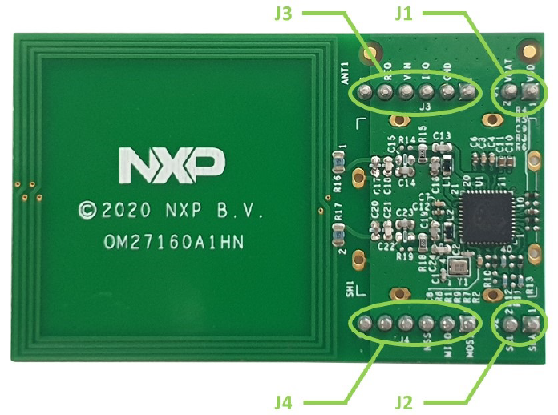

| J1 | PN7160 Signal |
|:---|:---|
| #1 | VDD(PAD): 1.8 V or 3.3 V host interface voltage reference |
| #2 | VDD(UP)/VBAT: 2.8 V to 5.5 V supply voltage |

| J2 | PN7160 Signal (only relevant for OM27160A1HN I2C version) |
|:---|:---|
| #1 | I2C_SDA: I2C-bus serial data |
| #2 | I2C_SCL: I2C-bus serial clock input |

| J3 | PN7160 Signal |
|:---|:---|
| #1 | Not connected |
| #2 | GND: ground |
| #3 | IRQ: interrupt request output |
| #4 | VEN: reset pin input |
| #5 | DWL_REQ: download request pin input |
| #6 | Not connected |

| J4 | PN7160 Signal |
|:----|:---|
| #1  | SPI_COTI: SPI-bus Controller Output, Target Input data (MOSI) |
| #2  | SPI_CITO: SPI-bus Controller Input, Target Output data (MISO) |
| #3  | SPI_NSS: SPI-bus Target Select (CS) |
| #4  | SPI_SCK: SPI-bus Serial Clock (SCK) |
| #5  | Not connected |
| #6  | Not connected |

**FT232H Breakout (USB-C to SPI bridge)**

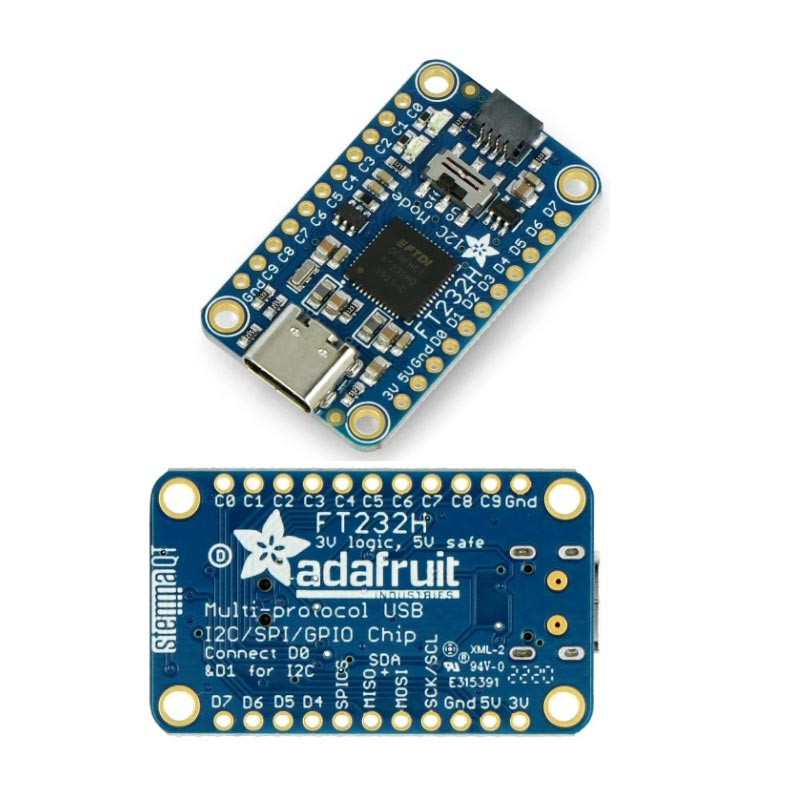

## Hardware Connection Schema (SPI mode)

| FT232H Pin | OM27160B1HN Pin | Function | Description |
|:-----------|:----------------|:---------|:------------|
| D0 | J4/#4 - SCK | Serial Clock | SPI Clock Signal |
| D1 | J4/#1 - MOSI | Master Out Slave IN | Data from PC to PN7160 |
| D2 | J4/#2 - MISO | Master In Slave Out | Data from PN7160 to PC |
| D3 | J4/#3 - NSS | Chip Select | SPI Slave Select (Active Low) |
| D5 | J3/#3 - IRQ | Interrupt Request | PN7160 signaling data ready |
| C2 | J3/#5 - DWL_REQ | Download Request | Firmware update / Bootloader mode |
| C3 | J3/#4 - VEN | PN7160 Enable | Reset/Power control for PN7160 |
| GND | J3/#2 - GND | Common Ground | Shared reference |
| 3V | J1/#1 - 3V | Logic Level VCC | Reference for I/O logic levels |
| 5V | J1/#2 - 5V | System Power | Main power supply for the board |

### FT232H & OM27160B1HN connection


**Homemade board stack**

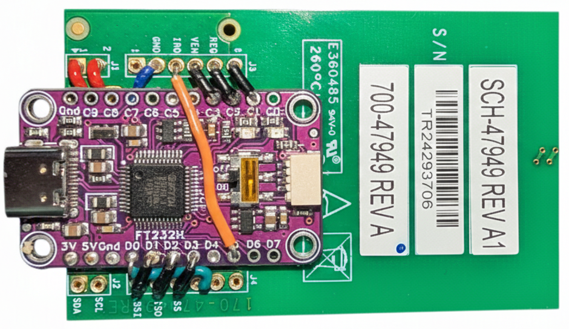

*Note: C1 PIN is connected only for mechanical stability, not used anymore.*

## Emulation Timings

With these boards using SPI at 1 MHz I achieve response times between 2.5 and 3.5 ms. Most of this is USB bus latency — with careful tuning it could be lower, but will never drop below ~1.5 ms. Host CPU processing time is negligible by comparison.

---

# Build Instructions

## Prerequisites

| Tool | Version | Notes |
|------|---------|-------|
| CMake | 3.21+ | |
| C++ compiler | C++17 | GCC 11+, MSYS2 UCRT recommended on Windows |
| Qt6 | 6.x | Base and SVG modules required |
| libusb | 1.0 | |
| libftdi | 1.x | |

### Application targets

| Target | Binary | Description |
|--------|--------|-------------|
| `hce-lab` | `hce-lab` / `hce-lab.exe` | Qt6 GUI application |
| `hce-ut` | `hce-ut` / `hce-ut.exe` | Integration test suite |
| `hce-t4t` | `hce-t4t` / `hce-t4t.exe` | CLI test tool (no Qt) |

---

## Build on Linux

Install dependencies (Ubuntu/Debian):

```bash
sudo apt install cmake g++ qt6-base-dev libqt6svg6 libusb-1.0-0-dev zlib1g-dev libgl1-mesa-dev libftdi1-dev
```

Clone and build:

```bash
git clone https://github.com/josevcm/hce-laboratory.git
cd hce-laboratory

# Release build (GUI application)
cmake -DCMAKE_BUILD_TYPE=Release -S . -B build
cmake --build build --target hce-lab -- -j$(nproc)

# Debug build with test suite
cmake -DCMAKE_BUILD_TYPE=Debug -S . -B build-debug
cmake --build build-debug --target hce-ut -- -j$(nproc)

# Launch the GUI application
./build/src/hce-app/app-qt/hce-lab
```

---

## Build on Windows (MSYS2 UCRT)

### 1. Install MSYS2

Download the MSYS2 installer from [msys2.org](https://www.msys2.org/) and install to `C:\develop\msys64` or `D:\develop\msys64`.

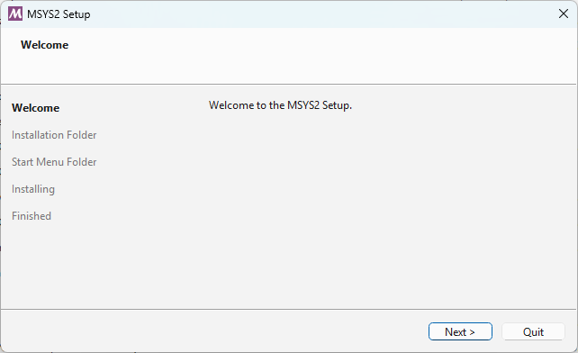

### 2. Install dependencies

Open the **MSYS2 UCRT64** shell and run:

```
pacman -S mingw-w64-ucrt-x86_64-qt6-base
pacman -S mingw-w64-ucrt-x86_64-qt6-svg
pacman -S mingw-w64-ucrt-x86_64-gcc
pacman -S mingw-w64-ucrt-x86_64-cmake
pacman -S mingw-w64-ucrt-x86_64-ninja
pacman -S mingw-w64-ucrt-x86_64-libusb
pacman -S mingw-w64-ucrt-x86_64-libftdi
```

### 3. Clone and build

Open **PowerShell** and locate your MSYS2 installation:

```powershell
$msys2 = @("C:\develop\msys64", "D:\develop\msys64") | Where-Object { Test-Path $_ } | Select-Object -First 1
$env:PATH = "$msys2\ucrt64\bin;$msys2\usr\bin;" + $env:PATH

git clone https://github.com/josevcm/hce-laboratory.git
cd hce-laboratory
```

Two pre-configured build trees are available:

```powershell
# Release build (GUI application)
cmake --build cmake-build-release --target hce-lab

# Debug build with test suite
cmake --build cmake-build-debug --target hce-ut

# Copy the application binary for easy access
cp .\cmake-build-release\src\hce-app\app-qt\hce-lab.exe hce-lab.exe
```

> [!IMPORTANT]
> Always prepend `$env:PATH = "$msys2\ucrt64\bin;$msys2\usr\bin;" + $env:PATH` in the same PowerShell command as `cmake`. Without it, the compiler cannot find its runtime DLLs.

---

## FT232H Driver Setup (Windows only)

### Configure IO pins with FT_PROG

Download and install [FT_PROG](https://ftdichip.com/utilities/). Connect the FT232H and select **DEVICES → Scan and Parse**.

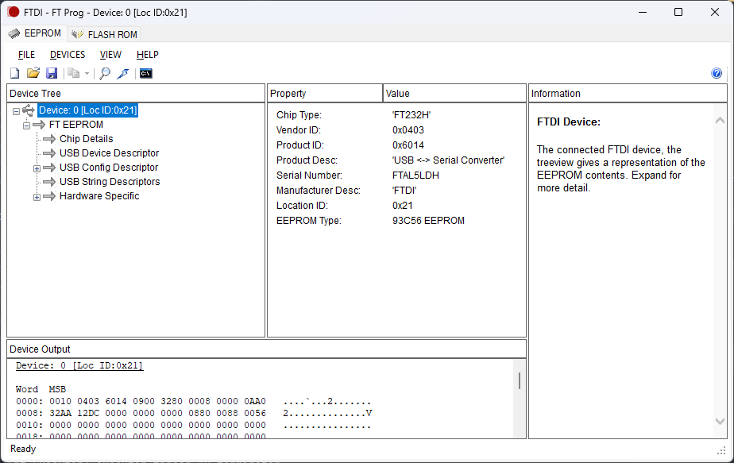

In **Hardware Specific → IO Controls**, set all ports to **Tristate**:

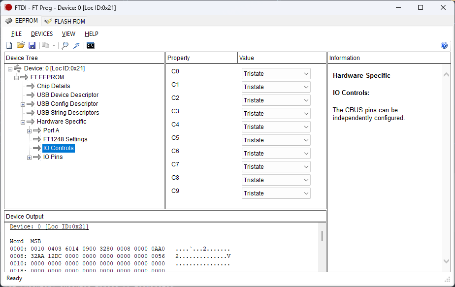

### Replace the driver with Zadig

Download [zadig](https://zadig.akeo.ie/). Select **Options → List All Devices**, find your FT232H adapter (listed as **Single RS232-HS**), choose **libusbK** (or WinUSB), and press **Replace Driver**.

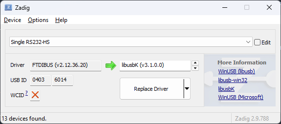

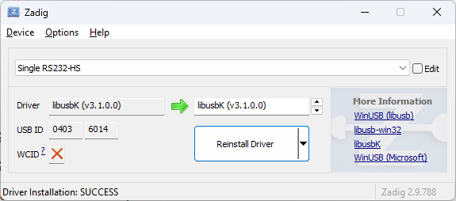

---

## Reference Links

The following resources are archived here as reference for how emulation works:

* [ISO/IEC 7816-4 Standard](https://www.freecalypso.org/pub/GSM/ISO7816/ISO_7816-4_2005.pdf)
* [DESFire EV0 Datasheet (M075031, April 2004)](https://web.archive.org/web/20170201031920/http://neteril.org/files/M075031_desfire.pdf)
* [DESFire Functional specification (MF3ICD81, November 2008)](https://web.archive.org/web/20201115030854/https://marvin.blogreen.org/~romain/nfc/MF3ICD81%20-%20MIFARE%20DESFire%20-%20Functional%20specification%20-%20Rev.%203.5%20-%2028%20November%202008.pdf)
* [Mifare Plus (MF1PLUSx0y1, March 2009)](https://marvin.blogreen.org/~romain/nfc/Mifare%20Plus.pdf)
* [NXP Application Note AN12343](https://www.nxp.com/docs/en/application-note/AN12343.pdf)
* [TI DESFire EV1 Tag AES Auth Specs (sloa213.pdf)](https://www.ti.com/lit/an/sloa213/sloa213.pdf)
* [NXP Application Note AN10833](https://www.nxp.com/docs/en/application-note/AN10833.pdf)

---

## License

This project is licensed under the **GNU General Public License v3.0 (GPL-3.0)**. This ensures that the core protocol stack remains open-source and benefits the global security community.

## Trademark Notice

MIFARE and DESFire are registered trademarks of NXP Semiconductors. PN7160 and related product names are trademarks of NXP Semiconductors. This project is not affiliated with, endorsed by, or sponsored by NXP Semiconductors in any way.

---

*Disclaimer: This project is intended for educational and professional auditing purposes only. Always ensure you have permission before testing on systems you do not own.*
